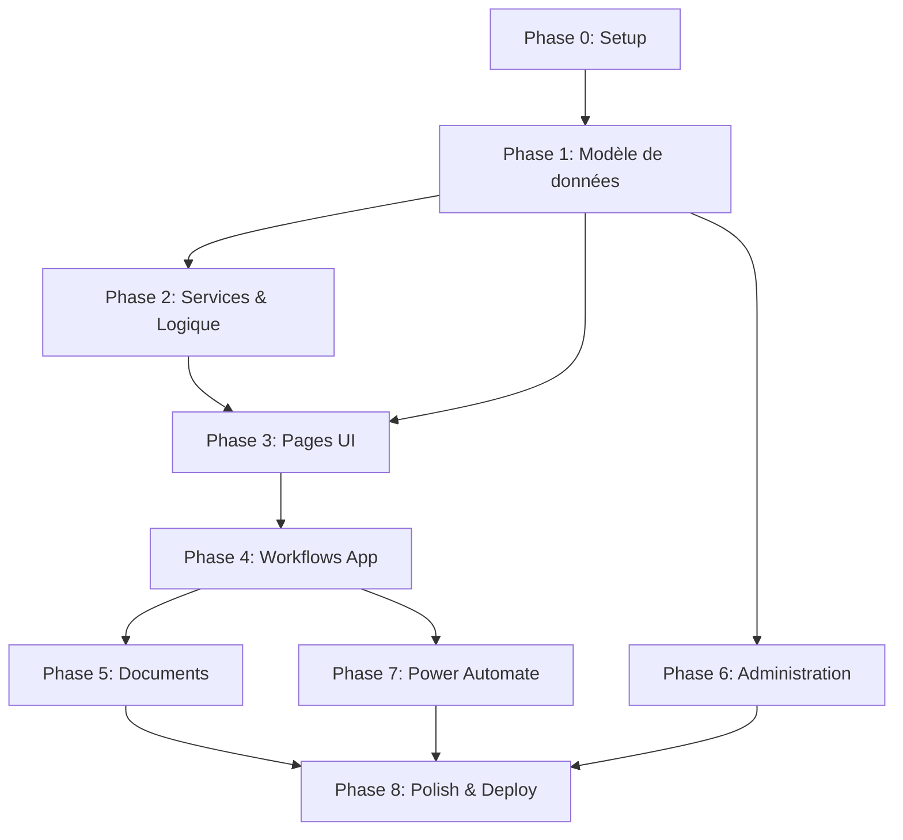

# BACKLOG — Application de Gestion des Congés
## Groupe Castel-Afrique | Power Apps + Dataverse + Power Automate
### Préfixe Publisher Dataverse : `df_`

---

# Phase 0 — Setup & Configuration

## Epic: Infrastructure & Fondations
**Goal**: Mettre en place la structure technique de l'application (solution Dataverse, sécurité, navigation, layout).
**Scope**: Configuration de la solution, rôles de sécurité, navigation principale. Exclut : logique métier, données.

### Feature: Structure de la solution Power Platform
**User Story**: En tant qu'administrateur, je veux une solution Dataverse correctement configurée afin de déployer l'application de manière propre et maintenable.
**Acceptance Criteria**:
- [ ] Solution Dataverse créée avec le préfixe `df_`
- [ ] Environnement de développement provisionné
- [ ] Solution contient l'application Canvas/Model-driven

#### PBI: Création de la solution Dataverse
**Description**: Créer la solution managée/non-managée dans l'environnement Power Platform avec le préfixe publisher `df_`.
**Entité Dataverse**: N/A (configuration)
**Champs impactés**: N/A
**Route UI**: N/A
**Composants**: Solution Power Platform
**Dépendances**: Aucune
**Done**:
- [ ] Solution `df_GestionConges` créée
- [ ] Publisher configuré avec préfixe `df_`
- [ ] Application Power Apps ajoutée à la solution

---

### Feature: Rôles de sécurité
**User Story**: En tant qu'administrateur, je veux configurer les rôles de sécurité afin que chaque utilisateur n'accède qu'aux données relevant de son périmètre.
**Acceptance Criteria**:
- [ ] 5 rôles créés : Employé, Manager, Chef de département, RH, Administrateur
- [ ] Chaque rôle a des permissions CRUD adaptées
- [ ] Un utilisateur peut cumuler des rôles

#### PBI: Création des rôles de sécurité Dataverse
**Description**: Créer 5 Security Roles dans Dataverse avec les niveaux d'accès appropriés (User, BU, Parent-Child BU, Organization).
**Entité Dataverse**: N/A (sécurité)
**Champs impactés**: N/A
**Route UI**: N/A
**Composants**: Security Roles Dataverse
**Dépendances**: PBI Création de la solution
**Done**:
- [ ] Rôle `df_Employe` : lecture propre, création propre
- [ ] Rôle `df_Manager` : lecture BU, approbation
- [ ] Rôle `df_ChefDepartement` : lecture Parent-Child BU
- [ ] Rôle `df_RH` : lecture/écriture Organisation
- [ ] Rôle `df_Administrateur` : accès complet

---

### Feature: Navigation & Layout principal
**User Story**: En tant qu'utilisateur, je veux une navigation claire et adaptée à mon rôle afin d'accéder rapidement aux fonctionnalités qui me concernent.
**Acceptance Criteria**:
- [ ] Menu latéral avec sections contextuelles par rôle
- [ ] Page d'accueil / Dashboard
- [ ] Navigation responsive

#### PBI: Layout principal de l'application
**Description**: Créer le shell de l'application avec la navigation latérale et le routage des pages principales. La navigation s'adapte selon le rôle de l'utilisateur connecté.
**Entité Dataverse**: N/A
**Champs impactés**: N/A
**Route UI**: / (racine)
**Composants**: App.tsx, Navigation.tsx, Layout.tsx
**Dépendances**: PBI Rôles de sécurité
**Done**:
- [ ] `npm run build` passe
- [ ] `npm run lint` passe
- [ ] Navigation affiche les onglets selon le rôle
- [ ] Fluent UI v9 respecté

```
┌─────────────────────────────────────────────────────┐
│ [Logo] Gestion des Congés    [User] [Notifications] │
├──────────┬──────────────────────────────────────────┤
│ ☰ Menu   │                                          │
│ Accueil  │        [Contenu principal]               │
│ Congés   │                                          │
│ Absences │                                          │
│ Équipe   │                                          │
│ Admin    │                                          │
└──────────┴──────────────────────────────────────────┘
```

---

# Phase 1 — Modèle de données

## Epic: Tables Dataverse
**Goal**: Créer toutes les tables et relations nécessaires au fonctionnement de l'application.
**Scope**: Tables, colonnes, relations, option sets. Exclut : logique métier, UI.

### Feature: Table Employés
**User Story**: En tant que RH, je veux disposer d'une table centralisée des employés afin de gérer les informations du personnel de manière fiable.
**Acceptance Criteria**:
- [ ] Table créée avec tous les champs requis
- [ ] Relations vers Département et Manager configurées
- [ ] Option Sets pour statut et type de contrat

#### PBI: Création de la table df_employes
**Description**: Créer la table `df_employes` dans Dataverse avec toutes les colonnes décrites ci-dessous.
**Entité Dataverse**: `df_employes`
**Champs impactés**:
| Nom logique | Type | Description |
|---|---|---|
| df_employeid | Uniqueidentifier (PK) | Identifiant unique |
| df_matricule | Text (20) | Matricule employé |
| df_nom | Text (100) | Nom de famille |
| df_prenom | Text (100) | Prénom |
| df_nomcomplet | Text (200) | Nom complet (Display Name Entra) |
| df_email | Text (200) | Email professionnel |
| df_upn | Text (200) | User Principal Name (Entra ID) |
| df_telephone | Text (20) | Téléphone |
| df_dateembauche | Date | Date d'embauche |
| df_anciennete | Whole Number | Ancienneté en années (calculé) |
| df_typecontrat | Option Set | Local (919770001), Non-Local (919770002) |
| df_statut | Option Set | Actif (919770001), Inactif (919770002) |
| df_departementid | Lookup → df_departements | Département |
| df_managerid | Lookup → df_employes (self) | Manager direct |
| df_chefdepartementid | Lookup → df_employes (self) | Chef de département |
| df_filiale | Text (100) | Filiale |
| df_poste | Text (100) | Poste occupé |

**Route UI**: N/A
**Composants**: N/A (Dataverse)
**Dépendances**: PBI Création de la solution
**Done**:
- [ ] Table créée dans Dataverse
- [ ] Toutes les colonnes présentes
- [ ] Relations self-referencing fonctionnelles
- [ ] Option Sets avec valeurs numériques correctes

---

### Feature: Table Départements
**User Story**: En tant qu'administrateur, je veux une table des départements afin de structurer l'organisation hiérarchique.
**Acceptance Criteria**:
- [ ] Table créée avec nom et chef de département
- [ ] Relation 1:N vers Employés

#### PBI: Création de la table df_departements
**Description**: Créer la table de référence des départements.
**Entité Dataverse**: `df_departements`
**Champs impactés**:
| Nom logique | Type | Description |
|---|---|---|
| df_departementid | Uniqueidentifier (PK) | Identifiant unique |
| df_nom | Text (100) | Nom du département |
| df_code | Text (20) | Code département |
| df_chefdepartementid | Lookup → df_employes | Chef de département |
| df_filiale | Text (100) | Filiale |

**Route UI**: N/A
**Composants**: N/A
**Dépendances**: PBI Table df_employes
**Done**:
- [ ] Table créée
- [ ] Relation vers df_employes configurée

---

### Feature: Table Types de congé
**User Story**: En tant que RH, je veux catégoriser les congés par type afin de gérer les règles et soldes de manière différenciée.
**Acceptance Criteria**:
- [ ] Table créée avec nom, nature et règles associées
- [ ] Types configurables par l'admin

#### PBI: Création de la table df_typesconge
**Description**: Créer la table de référence des types de congé (annuel, maladie, maternité, etc.).
**Entité Dataverse**: `df_typesconge`
**Champs impactés**:
| Nom logique | Type | Description |
|---|---|---|
| df_typecongeid | Uniqueidentifier (PK) | Identifiant unique |
| df_nom | Text (100) | Nom du type (Congé annuel, Maladie, Maternité…) |
| df_code | Text (20) | Code type |
| df_nature | Option Set | Payé (919770001), Non-Payé (919770002) |
| df_deductible | Boolean | Déduit du solde (oui/non) |
| df_justificatifrequis | Boolean | Justificatif obligatoire |
| df_description | Text (500) | Description du type |

**Route UI**: N/A
**Composants**: N/A
**Dépendances**: PBI Création de la solution
**Done**:
- [ ] Table créée
- [ ] Option Set nature avec valeurs correctes

---

### Feature: Table Demandes de congé
**User Story**: En tant qu'employé, je veux soumettre des demandes de congé afin qu'elles soient traitées par le circuit d'approbation.
**Acceptance Criteria**:
- [ ] Table créée avec tous les champs fonctionnels
- [ ] Statuts du workflow correctement définis
- [ ] Relations vers Employé et Type de congé

#### PBI: Création de la table df_demandedeconge
**Description**: Créer la table principale des demandes de congé.
**Entité Dataverse**: `df_demandedeconge`
**Champs impactés**:
| Nom logique | Type | Description |
|---|---|---|
| df_demandecongeid | Uniqueidentifier (PK) | Identifiant unique |
| df_numero | Auto-Number | Numéro séquentiel (CONG-000001) |
| df_employeid | Lookup → df_employes | Demandeur |
| df_typecongeid | Lookup → df_typesconge | Type de congé |
| df_datedebut | Date | Date de début |
| df_datefin | Date | Date de fin |
| df_nbjourdemandes | Decimal (2) | Nombre de jours demandés |
| df_solderestant | Decimal (2) | Solde restant après déduction (calculé) |
| df_statut | Option Set | Brouillon (919770001), Soumise (919770002), Approuvée Manager (919770003), Approuvée Chef (919770004), Approuvée RH (919770005), Refusée (919770006), Annulée (919770007) |
| df_commentaireemploye | Multiline Text | Commentaire de l'employé |
| df_commentairemanager | Multiline Text | Commentaire du manager |
| df_commentairechef | Multiline Text | Commentaire du chef dept |
| df_commentairerh | Multiline Text | Commentaire RH |
| df_datesoumission | DateTime | Date de soumission |
| df_dateapprobmanager | DateTime | Date approbation manager |
| df_dateapprobchef | DateTime | Date approbation chef |
| df_dateapprobrh | DateTime | Date approbation RH |
| df_pourautrui | Boolean | Demande faite pour un collègue |
| df_beneficiaireid | Lookup → df_employes | Bénéficiaire si pour autrui |

**Route UI**: N/A
**Composants**: N/A
**Dépendances**: PBI Table df_employes, PBI Table df_typesconge
**Done**:
- [ ] Table créée
- [ ] Auto-Number configuré
- [ ] Option Set statut avec 7 valeurs
- [ ] Relations Lookup fonctionnelles

---

### Feature: Table Soldes de congé
**User Story**: En tant qu'employé, je veux consulter mon solde de congé par type afin de savoir combien de jours il me reste.
**Acceptance Criteria**:
- [ ] Table créée avec solde par type et par employé
- [ ] Solde initial, acquis, consommé, restant

#### PBI: Création de la table df_soldesconge
**Description**: Créer la table de suivi des soldes par employé et par type de congé.
**Entité Dataverse**: `df_soldesconge`
**Champs impactés**:
| Nom logique | Type | Description |
|---|---|---|
| df_soldecongeid | Uniqueidentifier (PK) | Identifiant unique |
| df_employeid | Lookup → df_employes | Employé |
| df_typecongeid | Lookup → df_typesconge | Type de congé |
| df_annee | Whole Number | Année de référence |
| df_soldeinitial | Decimal (2) | Solde initial en début d'année |
| df_acquis | Decimal (2) | Jours acquis (crédits mensuels) |
| df_consomme | Decimal (2) | Jours consommés |
| df_restant | Decimal (2) | Solde restant (calculé: initial + acquis - consommé) |

**Route UI**: N/A
**Composants**: N/A
**Dépendances**: PBI Table df_employes, PBI Table df_typesconge
**Done**:
- [ ] Table créée
- [ ] Contrainte unicité (employé + type + année)

---

### Feature: Table Délégations
**User Story**: En tant que manager, je veux déléguer mes droits d'approbation à un collègue pendant mon absence afin d'éviter le blocage des demandes.
**Acceptance Criteria**:
- [ ] Table créée avec délégant, délégué, dates début/fin
- [ ] Vérification des délégations actives possible

#### PBI: Création de la table df_delegations
**Description**: Créer la table gérant les délégations temporaires de droits d'approbation.
**Entité Dataverse**: `df_delegations`
**Champs impactés**:
| Nom logique | Type | Description |
|---|---|---|
| df_delegationid | Uniqueidentifier (PK) | Identifiant unique |
| df_delegantid | Lookup → df_employes | Personne qui délègue |
| df_delegueid | Lookup → df_employes | Personne qui reçoit la délégation |
| df_datedebut | Date | Date de début de délégation |
| df_datefin | Date | Date de fin de délégation |
| df_statut | Option Set | Active (919770001), Expirée (919770002), Annulée (919770003) |
| df_motif | Text (200) | Motif de la délégation |

**Route UI**: N/A
**Composants**: N/A
**Dépendances**: PBI Table df_employes
**Done**:
- [ ] Table créée
- [ ] Relations Lookup correctes
- [ ] Option Set statut configuré

---

### Feature: Table Demandes d'absence
**User Story**: En tant qu'employé, je veux déclarer une absence courte (quelques heures) afin de formaliser mon indisponibilité.
**Acceptance Criteria**:
- [ ] Table créée avec date, heure début, durée, raison
- [ ] Statuts d'approbation séquentiels
- [ ] Calcul automatique heure de fin

#### PBI: Création de la table df_demandeabsence
**Description**: Créer la table des demandes d'absence courte (< 1 jour).
**Entité Dataverse**: `df_demandeabsence`
**Champs impactés**:
| Nom logique | Type | Description |
|---|---|---|
| df_demandeabsenceid | Uniqueidentifier (PK) | Identifiant unique |
| df_numero | Auto-Number | Numéro séquentiel (ABS-000001) |
| df_employeid | Lookup → df_employes | Demandeur |
| df_date | Date | Date de l'absence |
| df_heuredebut | Text (5) | Heure de début (07:00 à 18:00, pas de 30 min) |
| df_duree | Option Set | 1h (919770001), 2h (919770002), 3h (919770003), 4h (919770004) |
| df_heurefin | Text (5) | Heure de fin (calculée) |
| df_raison | Multiline Text | Raison (texte libre) |
| df_statut | Option Set | Soumise (919770001), Approuvée Manager (919770002), Approuvée Chef (919770003), Approuvée RH (919770004), Refusée (919770005), Annulée (919770006) |
| df_deduiresolde | Boolean | Déduire du solde congé (décidé par manager) |
| df_joursadeduits | Decimal (2) | Jours déduits (heures ÷ 8) |
| df_commentairemanager | Multiline Text | Commentaire manager |
| df_commentairechef | Multiline Text | Commentaire chef dept |
| df_commentairerh | Multiline Text | Commentaire RH |

**Route UI**: N/A
**Composants**: N/A
**Dépendances**: PBI Table df_employes
**Done**:
- [ ] Table créée
- [ ] Auto-Number configuré
- [ ] Option Set durée avec 4 valeurs
- [ ] Option Set statut avec 6 valeurs

---

### Feature: Table Jours fériés
**User Story**: En tant que RH, je veux gérer la liste des jours fériés afin qu'ils soient automatiquement exclus du calcul des jours ouvrés.
**Acceptance Criteria**:
- [ ] Table créée avec date, libellé, récurrence
- [ ] Prise en compte dans le calcul des jours de congé

#### PBI: Création de la table df_joursferies
**Description**: Créer la table de référence des jours fériés.
**Entité Dataverse**: `df_joursferies`
**Champs impactés**:
| Nom logique | Type | Description |
|---|---|---|
| df_jourferieid | Uniqueidentifier (PK) | Identifiant unique |
| df_date | Date | Date du jour férié |
| df_libelle | Text (100) | Libellé (ex: Fête nationale) |
| df_recurrent | Boolean | Récurrent chaque année (oui/non) |

**Route UI**: N/A
**Composants**: N/A
**Dépendances**: PBI Création de la solution
**Done**:
- [ ] Table créée
- [ ] Champs correctement typés

---

# Phase 2 — Services & Logique métier

## Epic: Calculs & Règles métier
**Goal**: Implémenter toute la logique de calcul (jours ouvrés, soldes, alertes) et les services CRUD.
**Scope**: Fonctions de calcul, services de données. Exclut : UI, workflows Power Automate.

### Feature: Calcul des jours ouvrés
**User Story**: En tant qu'employé, je veux que le nombre de jours demandés soit calculé automatiquement (excluant weekends et jours fériés) afin d'éviter les erreurs.
**Acceptance Criteria**:
- [ ] Calcul exclut samedis et dimanches
- [ ] Calcul exclut les jours fériés de la table df_joursferies
- [ ] Résultat affiché en temps réel lors de la saisie

#### PBI: Service de calcul des jours ouvrés
**Description**: Implémenter une fonction qui calcule le nombre de jours ouvrés entre deux dates, en excluant weekends et jours fériés.
**Entité Dataverse**: df_joursferies (lecture), df_demandedeconge (écriture df_nbjourdemandes)
**Champs impactés**: df_nbjourdemandes, df_solderestant
**Route UI**: N/A (service partagé)
**Composants**: CalculJoursOuvres.ts
**Dépendances**: PBI Table df_joursferies, PBI Table df_demandedeconge
**Done**:
- [ ] `npm run build` passe
- [ ] `npm run lint` passe
- [ ] Weekends exclus
- [ ] Jours fériés exclus
- [ ] Tests unitaires passent

---

### Feature: Vérification du solde
**User Story**: En tant qu'employé, je veux être alerté si ma demande dépasse mon solde disponible afin de pouvoir l'ajuster avant soumission.
**Acceptance Criteria**:
- [ ] Alerte visuelle si jours demandés > solde restant
- [ ] Empêche pas la soumission (avertissement uniquement)
- [ ] Solde restant après déduction affiché

#### PBI: Service de vérification de solde
**Description**: Implémenter la vérification du solde lors de la création d'une demande. Calculer solde restant = solde actuel - jours demandés. Afficher un warning si négatif.
**Entité Dataverse**: df_soldesconge (lecture)
**Champs impactés**: df_solderestant sur df_demandedeconge
**Route UI**: N/A (service partagé)
**Composants**: VerificationSolde.ts
**Dépendances**: PBI Table df_soldesconge, PBI Calcul jours ouvrés
**Done**:
- [ ] `npm run build` passe
- [ ] Alerte affichée si dépassement
- [ ] Solde correctement calculé

---

### Feature: Calcul heure de fin (absences)
**User Story**: En tant qu'employé, je veux que l'heure de fin de mon absence soit calculée automatiquement afin de ne saisir que l'heure de début et la durée.
**Acceptance Criteria**:
- [ ] Heure fin = Heure début + Durée
- [ ] Affichage immédiat après sélection

#### PBI: Service de calcul heure de fin absence
**Description**: Calculer automatiquement `df_heurefin` = `df_heuredebut` + `df_duree`. Exemple : début 09:00, durée 2h → fin 11:00.
**Entité Dataverse**: df_demandeabsence
**Champs impactés**: df_heurefin
**Route UI**: N/A
**Composants**: CalculHeureFinAbsence.ts
**Dépendances**: PBI Table df_demandeabsence
**Done**:
- [ ] `npm run build` passe
- [ ] Calcul correct pour toutes les tranches horaires

---

### Feature: Déduction solde pour absence
**User Story**: En tant que manager, je veux pouvoir déduire les heures d'absence du solde de congé de l'employé afin de comptabiliser les absences répétées.
**Acceptance Criteria**:
- [ ] Option "Déduire du solde" disponible à l'approbation
- [ ] Calcul : heures ÷ 8 = jours déduits
- [ ] Solde mis à jour automatiquement

#### PBI: Service de déduction solde absence
**Description**: Si le manager active l'option `df_deduiresolde`, calculer `df_joursadeduits` = durée_heures / 8 et décrémenter le premier solde de congé disponible de l'employé.
**Entité Dataverse**: df_demandeabsence, df_soldesconge
**Champs impactés**: df_deduiresolde, df_joursadeduits, df_restant (solde)
**Route UI**: N/A
**Composants**: DeductionSoldeAbsence.ts
**Dépendances**: PBI Table df_soldesconge, PBI Table df_demandeabsence
**Done**:
- [ ] `npm run build` passe
- [ ] Calcul correct (1h=0.125j, 2h=0.25j, 3h=0.375j, 4h=0.5j)
- [ ] Solde mis à jour dans df_soldesconge

---

# Phase 3 — Pages principales

## Epic: Interface Employé
**Goal**: Fournir aux employés les écrans de soumission et de suivi de leurs demandes de congé et d'absence.
**Scope**: Dashboard employé, formulaire congé, formulaire absence, historiques. Exclut : vues manager/RH.

### Feature: Dashboard Employé
**User Story**: En tant qu'employé, je veux voir un tableau de bord avec mes soldes et mes demandes récentes afin d'avoir une vue d'ensemble rapide.
**Acceptance Criteria**:
- [ ] Affichage des soldes par type de congé
- [ ] Liste des 5 dernières demandes avec statut
- [ ] Ancienneté affichée
- [ ] Bouton "Nouvelle demande"

#### PBI: Page Dashboard Employé
**Description**: Créer la page d'accueil de l'employé avec les cards soldes, la liste des demandes récentes et les raccourcis.
**Entité Dataverse**: df_soldesconge (lecture), df_demandedeconge (lecture), df_employes (lecture)
**Champs impactés**: Lecture seule
**Route UI**: /dashboard
**Composants**: DashboardEmploye.tsx, CardSolde.tsx, ListeDemandesRecentes.tsx
**Dépendances**: PBI Table df_soldesconge, PBI Table df_demandedeconge
**Done**:
- [ ] `npm run build` passe
- [ ] `npm run lint` passe
- [ ] Fluent UI v9 respecté
- [ ] Soldes affichés correctement
- [ ] Demandes récentes visibles

```
┌─────────────────────────────────────────────────────┐
│ 🏠 Mon Tableau de Bord                              │
├─────────────────────────────────────────────────────┤
│ ┌──────────┐ ┌──────────┐ ┌──────────┐            │
│ │ Congé An.│ │ Maladie  │ │ Maternité│            │
│ │  18 jours│ │  5 jours │ │  0 jours │            │
│ └──────────┘ └──────────┘ └──────────┘            │
│                                                     │
│ Ancienneté : 3 ans        [+ Nouvelle demande]      │
│                                                     │
│ ┌───────────────────────────────────────────────┐  │
│ │ N°       │ Type    │ Dates      │ Statut      │  │
│ │ CONG-042 │ Annuel  │ 15-20 Jun  │ ✅ Approuvée│  │
│ │ CONG-041 │ Annuel  │ 01-03 Mai  │ ⏳ En cours │  │
│ └───────────────────────────────────────────────┘  │
└─────────────────────────────────────────────────────┘
```

---

### Feature: Formulaire de demande de congé
**User Story**: En tant qu'employé, je veux créer une demande de congé en sélectionnant le type, les dates et en voyant le calcul automatique afin de soumettre une demande correcte.
**Acceptance Criteria**:
- [ ] Sélection du type de congé
- [ ] Sélection dates début/fin
- [ ] Calcul automatique du nombre de jours
- [ ] Affichage solde actuel et solde après déduction
- [ ] Alerte si dépassement de solde
- [ ] Champ commentaire optionnel
- [ ] Option "pour un collègue" (si pas de compte O365)
- [ ] Écran récapitulatif avant soumission

#### PBI: Formulaire création demande de congé — Étape 1 (Saisie)
**Description**: Créer le formulaire multi-étapes : sélection type congé, dates, calcul automatique jours, affichage solde.
**Entité Dataverse**: df_demandedeconge (écriture), df_typesconge (lecture), df_soldesconge (lecture), df_joursferies (lecture)
**Champs impactés**: df_typecongeid, df_datedebut, df_datefin, df_nbjourdemandes, df_commentaireemploye, df_pourautrui, df_beneficiaireid
**Route UI**: /conges/nouvelle
**Composants**: FormulaireConge.tsx, SelecteurTypeConge.tsx, SelecteurDates.tsx, AffichageSolde.tsx
**Dépendances**: PBI Service calcul jours ouvrés, PBI Service vérification solde
**Done**:
- [ ] `npm run build` passe
- [ ] `npm run lint` passe
- [ ] Fluent UI v9 respecté
- [ ] Calcul jours en temps réel
- [ ] Alerte dépassement fonctionnelle

```
┌─────────────────────────────────────────────────────┐
│ 📝 Nouvelle demande de congé                        │
├─────────────────────────────────────────────────────┤
│ Type de congé :    [▾ Congé annuel         ]        │
│                                                     │
│ Date de début :    [📅 15/06/2026]                  │
│ Date de fin :      [📅 20/06/2026]                  │
│                                                     │
│ Nombre de jours :  4 jours ouvrés                   │
│ Solde actuel :     18 jours                         │
│ Solde après :      14 jours  ✅                     │
│                                                     │
│ ☐ Demande pour un collègue                          │
│                                                     │
│ Commentaire : [________________________]            │
│                                                     │
│            [Suivant →]     [Annuler]                │
└─────────────────────────────────────────────────────┘
```

---

#### PBI: Formulaire création demande de congé — Étape 2 (Récapitulatif & Soumission)
**Description**: Écran récapitulatif montrant toutes les infos saisies. Bouton "Soumettre" qui change le statut à "Soumise" et déclenche le workflow.
**Entité Dataverse**: df_demandedeconge (écriture)
**Champs impactés**: df_statut (→ Soumise 919770002), df_datesoumission
**Route UI**: /conges/nouvelle (étape 2)
**Composants**: RecapitulatifConge.tsx
**Dépendances**: PBI Formulaire congé étape 1
**Done**:
- [ ] `npm run build` passe
- [ ] `npm run lint` passe
- [ ] Récapitulatif affiche toutes les informations
- [ ] Soumission met le statut à "Soumise"
- [ ] Données correctes dans Dataverse

```
┌─────────────────────────────────────────────────────┐
│ 📋 Récapitulatif de votre demande                   │
├─────────────────────────────────────────────────────┤
│ Type :           Congé annuel                       │
│ Du :             15/06/2026                         │
│ Au :             20/06/2026                         │
│ Jours demandés : 4 jours                           │
│ Solde après :    14 jours                          │
│ Commentaire :    Vacances familiales               │
│                                                     │
│        [← Modifier]   [✓ Soumettre]                │
└─────────────────────────────────────────────────────┘
```

---

### Feature: Historique des demandes de congé
**User Story**: En tant qu'employé, je veux consulter l'historique de toutes mes demandes de congé afin de suivre leur avancement.
**Acceptance Criteria**:
- [ ] Tableau avec numéro, type, dates, jours, statut
- [ ] Filtrage par statut
- [ ] Détail accessible au clic
- [ ] Possibilité d'annuler une demande "Brouillon" ou "Soumise"

#### PBI: Page historique demandes de congé
**Description**: Créer la page listant toutes les demandes de l'employé connecté avec filtres et actions.
**Entité Dataverse**: df_demandedeconge (lecture, écriture statut annulation)
**Champs impactés**: Lecture + df_statut (annulation → 919770007)
**Route UI**: /conges/historique
**Composants**: HistoriqueConges.tsx, FiltreStatut.tsx, LigneDemandeConge.tsx
**Dépendances**: PBI Table df_demandedeconge
**Done**:
- [ ] `npm run build` passe
- [ ] `npm run lint` passe
- [ ] Fluent UI v9 respecté
- [ ] Filtrage par statut fonctionnel
- [ ] Annulation fonctionne sur Brouillon/Soumise uniquement
- [ ] Données correctes depuis Dataverse

```
┌─────────────────────────────────────────────────────────────┐
│ 📜 Mes demandes de congé     Filtre: [▾ Tous les statuts ] │
├─────────────────────────────────────────────────────────────┤
│ N°       │ Type      │ Du       │ Au       │ Jours │ Statut │
│ CONG-042 │ Annuel    │ 15/06/26 │ 20/06/26 │ 4     │ ✅ App.│
│ CONG-041 │ Annuel    │ 01/05/26 │ 03/05/26 │ 2     │ ⏳ Soum│
│ CONG-040 │ Maladie   │ 10/04/26 │ 10/04/26 │ 1     │ ❌ Ref.│
├─────────────────────────────────────────────────────────────┤
│                              [Voir détail] [Annuler]        │
└─────────────────────────────────────────────────────────────┘
```

---

### Feature: Formulaire de demande d'absence
**User Story**: En tant qu'employé, je veux déclarer une absence courte en précisant la date, l'heure et la durée afin de formaliser mon indisponibilité.
**Acceptance Criteria**:
- [ ] Sélection de la date
- [ ] Sélection heure de début (07:00-18:00, pas de 30 min)
- [ ] Sélection durée (1h, 2h, 3h, 4h)
- [ ] Calcul automatique heure de fin
- [ ] Champ raison (texte libre)
- [ ] Soumission directe (statut → Soumise)

#### PBI: Formulaire création demande d'absence
**Description**: Créer le formulaire d'absence courte avec soumission directe.
**Entité Dataverse**: df_demandeabsence (écriture)
**Champs impactés**: df_date, df_heuredebut, df_duree, df_heurefin, df_raison, df_statut
**Route UI**: /absences/nouvelle
**Composants**: FormulaireAbsence.tsx, SelecteurHeure.tsx
**Dépendances**: PBI Table df_demandeabsence, PBI Service calcul heure fin
**Done**:
- [ ] `npm run build` passe
- [ ] `npm run lint` passe
- [ ] Fluent UI v9 respecté
- [ ] Heure de fin calculée automatiquement
- [ ] Soumission directe (statut = Soumise)
- [ ] Notification envoyée au manager

```
┌─────────────────────────────────────────────────────┐
│ 📝 Déclarer une absence                            │
├─────────────────────────────────────────────────────┤
│ Date :           [📅 15/06/2026]                   │
│ Heure de début : [▾ 09:00]                         │
│ Durée :          [▾ 2 heures]                      │
│ Heure de fin :   11:00 (calculée)                  │
│                                                     │
│ Raison : [______________________________]          │
│                                                     │
│              [✓ Soumettre]    [Annuler]             │
└─────────────────────────────────────────────────────┘
```

---

### Feature: Historique des absences
**User Story**: En tant qu'employé, je veux consulter l'historique de mes absences avec leur statut afin de suivre leur traitement.
**Acceptance Criteria**:
- [ ] Tableau : numéro, date, horaire (début-fin), durée, raison, statut, actions
- [ ] Filtre par statut
- [ ] Annulation possible si statut = Soumise

#### PBI: Page historique demandes d'absence
**Description**: Créer la page listant les absences de l'employé connecté.
**Entité Dataverse**: df_demandeabsence (lecture, écriture annulation)
**Champs impactés**: Lecture + df_statut (annulation → 919770006)
**Route UI**: /absences/historique
**Composants**: HistoriqueAbsences.tsx, LigneDemandeAbsence.tsx
**Dépendances**: PBI Table df_demandeabsence
**Done**:
- [ ] `npm run build` passe
- [ ] `npm run lint` passe
- [ ] Fluent UI v9 respecté
- [ ] Filtrage fonctionnel
- [ ] Annulation sur "Soumise" uniquement

```
┌────────────────────────────────────────────────────────────────────┐
│ 📜 Mes absences              Filtre: [▾ Tous les statuts ]        │
├────────────────────────────────────────────────────────────────────┤
│ N°       │ Date     │ Horaire    │ Durée │ Raison      │ Statut   │
│ ABS-012  │ 15/06/26 │ 09:00-11:00│ 2h    │ RDV médical │ ✅ Appr. │
│ ABS-011  │ 10/06/26 │ 14:00-16:00│ 2h    │ Personnel   │ ⏳ Soum. │
├────────────────────────────────────────────────────────────────────┤
│                                          [Annuler]                 │
└────────────────────────────────────────────────────────────────────┘
```

---

### Feature: Page Jours fériés (consultation)
**User Story**: En tant qu'employé, je veux consulter la liste des jours fériés afin de planifier mes congés en conséquence.
**Acceptance Criteria**:
- [ ] Tableau avec date, libellé, récurrent (oui/non)
- [ ] Lecture seule pour les employés

#### PBI: Page consultation jours fériés
**Description**: Créer une page en lecture seule affichant les jours fériés configurés.
**Entité Dataverse**: df_joursferies (lecture)
**Champs impactés**: Lecture seule
**Route UI**: /jours-feries
**Composants**: PageJoursFeries.tsx
**Dépendances**: PBI Table df_joursferies
**Done**:
- [ ] `npm run build` passe
- [ ] `npm run lint` passe
- [ ] Fluent UI v9 respecté
- [ ] Données affichées depuis Dataverse

---

## Epic: Interface Manager
**Goal**: Permettre aux managers de consulter, approuver/refuser les demandes de leur équipe et de gérer les délégations.
**Scope**: Vue demandes équipe, approbation/refus congés et absences, délégation. Exclut : validation Chef/RH.

### Feature: Liste des demandes à traiter (Manager)
**User Story**: En tant que manager, je veux voir la liste des demandes de congé soumises par mon équipe afin de les traiter rapidement.
**Acceptance Criteria**:
- [ ] Liste filtrée sur les subordonnés directs
- [ ] Affichage : employé, type, dates, jours, solde
- [ ] Actions : Approuver / Refuser avec commentaire
- [ ] Notifications reçues à chaque nouvelle demande

#### PBI: Page demandes congé à traiter (Manager)
**Description**: Créer la page listant les demandes au statut "Soumise" des subordonnés directs du manager connecté. Permettre approbation ou refus.
**Entité Dataverse**: df_demandedeconge (lecture/écriture), df_employes (lecture)
**Champs impactés**: df_statut (→ Approuvée Manager 919770003 ou Refusée 919770006), df_commentairemanager, df_dateapprobmanager
**Route UI**: /manager/conges
**Composants**: DemandesCongeManager.tsx, ModalApprobation.tsx, ModalRefus.tsx
**Dépendances**: PBI Table df_demandedeconge, PBI Table df_employes
**Done**:
- [ ] `npm run build` passe
- [ ] `npm run lint` passe
- [ ] Fluent UI v9 respecté
- [ ] Filtre sur subordonnés directs
- [ ] Approbation met statut à "Approuvée Manager"
- [ ] Refus met statut à "Refusée"
- [ ] Commentaire obligatoire en cas de refus
- [ ] Données correctes dans Dataverse

```
┌─────────────────────────────────────────────────────────────┐
│ 👥 Demandes de congé de mon équipe                          │
├─────────────────────────────────────────────────────────────┤
│ Employé      │ Type    │ Du       │ Au       │ Jours │Solde │
│ Dupont Marie │ Annuel  │ 15/06/26 │ 20/06/26 │ 4     │ 18  │
│              │         │          │   [✓ Approuver] [✗ Refuser]│
│ Martin Jean  │ Maladie │ 22/06/26 │ 22/06/26 │ 1     │ 5   │
│              │         │          │   [✓ Approuver] [✗ Refuser]│
└─────────────────────────────────────────────────────────────┘
```

---

### Feature: Absences à traiter (Manager)
**User Story**: En tant que manager, je veux traiter les demandes d'absence de mes subordonnés afin de valider ou refuser avec option de déduction du solde.
**Acceptance Criteria**:
- [ ] Liste des absences au statut "Soumise" des subordonnés
- [ ] Approbation avec option "Déduire du solde"
- [ ] Refus avec commentaire

#### PBI: Page absences à traiter (Manager)
**Description**: Créer l'onglet "Absences Manager" affichant les demandes d'absence au statut "Soumise" des subordonnés directs. Permettre approbation (avec/sans déduction) ou refus.
**Entité Dataverse**: df_demandeabsence (lecture/écriture), df_soldesconge (écriture si déduction)
**Champs impactés**: df_statut (→ Approuvée Manager 919770002 ou Refusée 919770005), df_deduiresolde, df_joursadeduits, df_commentairemanager
**Route UI**: /manager/absences
**Composants**: AbsencesManager.tsx, ModalApprobationAbsence.tsx
**Dépendances**: PBI Table df_demandeabsence, PBI Service déduction solde
**Done**:
- [ ] `npm run build` passe
- [ ] `npm run lint` passe
- [ ] Fluent UI v9 respecté
- [ ] Option "Déduire du solde" fonctionnelle
- [ ] Calcul déduction correct (heures ÷ 8)
- [ ] Données correctes dans Dataverse

```
┌─────────────────────────────────────────────────────────────────┐
│ 👥 Absences de mon équipe (en attente)                          │
├─────────────────────────────────────────────────────────────────┤
│ Employé      │ Date     │ Horaire     │ Durée │ Raison          │
│ Dupont Marie │ 15/06/26 │ 09:00-11:00 │ 2h    │ RDV médical     │
│   [✓ Approuver ☐ Déduire du solde]  [✗ Refuser]                │
└─────────────────────────────────────────────────────────────────┘
```

---

### Feature: Gestion des délégations (Manager)
**User Story**: En tant que manager, je veux déléguer mes droits d'approbation à un collègue pendant mon absence afin que les demandes ne soient pas bloquées.
**Acceptance Criteria**:
- [ ] Formulaire : sélection délégué, date début, date fin, motif
- [ ] Liste des délégations actives/passées
- [ ] Possibilité d'annuler une délégation active

#### PBI: Page gestion des délégations
**Description**: Créer la page permettant au manager de créer, visualiser et annuler ses délégations.
**Entité Dataverse**: df_delegations (CRUD)
**Champs impactés**: Tous les champs de df_delegations
**Route UI**: /manager/delegations
**Composants**: PageDelegations.tsx, FormulaireDelegation.tsx, ListeDelegations.tsx
**Dépendances**: PBI Table df_delegations
**Done**:
- [ ] `npm run build` passe
- [ ] `npm run lint` passe
- [ ] Fluent UI v9 respecté
- [ ] Création de délégation fonctionnelle
- [ ] Annulation possible
- [ ] Données correctes dans Dataverse

```
┌─────────────────────────────────────────────────────┐
│ 🔄 Mes délégations          [+ Nouvelle délégation] │
├─────────────────────────────────────────────────────┤
│ Délégué       │ Du       │ Au       │ Statut       │
│ Martin Jean   │ 01/07/26 │ 15/07/26 │ 🟢 Active   │
│               │          │          │ [Annuler]    │
├─────────────────────────────────────────────────────┤
│ ── Nouvelle délégation ──                           │
│ Délégué :  [▾ Sélectionner un collègue ]           │
│ Du :       [📅 ___]                                │
│ Au :       [📅 ___]                                │
│ Motif :    [________________________]              │
│                         [Créer]                     │
└─────────────────────────────────────────────────────┘
```

---

### Feature: Suivi équipe (Manager)
**User Story**: En tant que manager, je veux une vue synthétique des demandes de mon équipe (validées, refusées, en cours) afin de planifier l'activité.
**Acceptance Criteria**:
- [ ] Vue globale avec tous les statuts
- [ ] Filtres par employé, statut, période

#### PBI: Page suivi global équipe (Manager)
**Description**: Créer la page de suivi permettant au manager de consulter l'ensemble des demandes de son équipe, tous statuts confondus.
**Entité Dataverse**: df_demandedeconge (lecture), df_employes (lecture)
**Champs impactés**: Lecture seule
**Route UI**: /manager/suivi
**Composants**: SuiviEquipe.tsx, FiltresEquipe.tsx
**Dépendances**: PBI Table df_demandedeconge, PBI Table df_employes
**Done**:
- [ ] `npm run build` passe
- [ ] `npm run lint` passe
- [ ] Fluent UI v9 respecté
- [ ] Filtres fonctionnels

---

## Epic: Interface Chef de Département
**Goal**: Permettre au chef de département de valider en 2ème instance les demandes de congé et d'absence.
**Scope**: Validation finale congés, validation absences, suivi département. Exclut : validation RH.

### Feature: Demandes à valider (Chef Dept)
**User Story**: En tant que chef de département, je veux traiter les demandes pré-approuvées par le manager afin de les valider ou refuser au niveau département.
**Acceptance Criteria**:
- [ ] Liste des demandes au statut "Approuvée Manager" de son département
- [ ] Détail incluant la décision et commentaires du manager
- [ ] Actions : Approuver / Refuser avec commentaire

#### PBI: Page validation congés (Chef de département)
**Description**: Créer la page listant les demandes au statut "Approuvée Manager" pour les employés du département. Permettre approbation ou refus.
**Entité Dataverse**: df_demandedeconge (lecture/écriture)
**Champs impactés**: df_statut (→ Approuvée Chef 919770004 ou Refusée 919770006), df_commentairechef, df_dateapprobchef
**Route UI**: /chef-dept/conges
**Composants**: DemandesCongeChef.tsx, DetailDemandeChef.tsx
**Dépendances**: PBI Table df_demandedeconge
**Done**:
- [ ] `npm run build` passe
- [ ] `npm run lint` passe
- [ ] Fluent UI v9 respecté
- [ ] Filtre sur département
- [ ] Commentaire manager visible
- [ ] Approbation/refus fonctionnels
- [ ] Données correctes dans Dataverse

---

### Feature: Absences à valider (Chef Dept)
**User Story**: En tant que chef de département, je veux valider les absences déjà approuvées par le manager afin de confirmer la décision au niveau département.
**Acceptance Criteria**:
- [ ] Liste des absences au statut "Approuvée Manager" du département
- [ ] Approbation ou refus avec commentaire

#### PBI: Page validation absences (Chef de département)
**Description**: Créer l'onglet "Absences Chef Dept" affichant les demandes d'absence au statut "Approuvée Manager" du département.
**Entité Dataverse**: df_demandeabsence (lecture/écriture)
**Champs impactés**: df_statut (→ Approuvée Chef 919770003 ou Refusée 919770005), df_commentairechef
**Route UI**: /chef-dept/absences
**Composants**: AbsencesChefDept.tsx
**Dépendances**: PBI Table df_demandeabsence
**Done**:
- [ ] `npm run build` passe
- [ ] `npm run lint` passe
- [ ] Fluent UI v9 respecté
- [ ] Données correctes dans Dataverse

---

## Epic: Interface RH
**Goal**: Donner aux équipes RH une vue globale, la gestion des employés, la validation finale et la maintenance des données.
**Scope**: Gestion employés, vue globale demandes, validation finale, soldes, jours fériés. Exclut : Power Automate.

### Feature: Gestion des employés
**User Story**: En tant que RH, je veux gérer les dossiers des employés (ajout, modification, consultation) afin de maintenir des données à jour.
**Acceptance Criteria**:
- [ ] Liste des employés avec recherche et filtres
- [ ] Formulaire création/modification
- [ ] Import Excel possible

#### PBI: Page liste des employés (RH)
**Description**: Créer la page listant tous les employés avec recherche, filtres par département/statut, et accès au détail.
**Entité Dataverse**: df_employes (lecture)
**Champs impactés**: Lecture
**Route UI**: /rh/employes
**Composants**: ListeEmployes.tsx, FiltresEmployes.tsx, LigneEmploye.tsx
**Dépendances**: PBI Table df_employes
**Done**:
- [ ] `npm run build` passe
- [ ] `npm run lint` passe
- [ ] Fluent UI v9 respecté
- [ ] Recherche par nom/matricule fonctionnelle
- [ ] Filtres département/statut fonctionnels

```
┌─────────────────────────────────────────────────────────────────────┐
│ 👤 Gestion des employés   [🔍 Recherche] [▾ Dept] [▾ Statut]      │
│                                              [+ Nouvel employé]     │
├─────────────────────────────────────────────────────────────────────┤
│ Matricule │ Nom complet    │ Département │ Manager    │ Statut     │
│ EMP-001   │ Dupont Marie   │ Finance     │ Martin J.  │ 🟢 Actif  │
│ EMP-002   │ Martin Jean    │ IT          │ Duval P.   │ 🟢 Actif  │
│ EMP-003   │ Lefèvre Paul   │ RH          │ —          │ 🔴 Inactif│
└─────────────────────────────────────────────────────────────────────┘
```

---

#### PBI: Formulaire création/modification employé
**Description**: Créer le formulaire de saisie/édition d'un dossier employé avec tous les champs.
**Entité Dataverse**: df_employes (CRUD)
**Champs impactés**: Tous les champs de df_employes
**Route UI**: /rh/employes/nouveau, /rh/employes/:id
**Composants**: FormulaireEmploye.tsx
**Dépendances**: PBI Table df_employes, PBI Table df_departements
**Done**:
- [ ] `npm run build` passe
- [ ] `npm run lint` passe
- [ ] Fluent UI v9 respecté
- [ ] Création et modification fonctionnelles
- [ ] Données correctes dans Dataverse

---

#### PBI: Import Excel des employés
**Description**: Permettre l'import massif d'employés depuis un fichier Excel (reprise de données). Validation des données avant import.
**Entité Dataverse**: df_employes (écriture massive)
**Champs impactés**: Tous les champs de df_employes
**Route UI**: /rh/employes/import
**Composants**: ImportEmployes.tsx, ValidationImport.tsx
**Dépendances**: PBI Table df_employes
**Done**:
- [ ] `npm run build` passe
- [ ] `npm run lint` passe
- [ ] Upload Excel fonctionnel
- [ ] Validation pré-import (colonnes requises, formats)
- [ ] Rapport d'erreurs affiché
- [ ] Import réussi écrit dans Dataverse

---

### Feature: Vue globale des demandes (RH)
**User Story**: En tant que RH, je veux accéder à une vue globale de toutes les demandes de congé avec des filtres avancés afin de piloter la gestion des congés.
**Acceptance Criteria**:
- [ ] Toutes les demandes visibles (toute l'organisation)
- [ ] Filtres : statut, employé, département, type, période
- [ ] Export possible

#### PBI: Page vue globale demandes (RH)
**Description**: Créer la page affichant toutes les demandes de congé de l'organisation avec filtres multiples.
**Entité Dataverse**: df_demandedeconge (lecture), df_employes (lecture), df_departements (lecture)
**Champs impactés**: Lecture
**Route UI**: /rh/demandes
**Composants**: VueGlobaleDemandes.tsx, FiltresAvances.tsx
**Dépendances**: PBI Table df_demandedeconge
**Done**:
- [ ] `npm run build` passe
- [ ] `npm run lint` passe
- [ ] Fluent UI v9 respecté
- [ ] Tous les filtres fonctionnels
- [ ] Performance acceptable (pagination)

---

### Feature: Validation finale congés (RH)
**User Story**: En tant que RH, je veux valider les demandes approuvées par le chef de département afin de finaliser le processus.
**Acceptance Criteria**:
- [ ] Liste des demandes au statut "Approuvée Chef"
- [ ] Approbation (→ Approuvée RH) ou Refus
- [ ] Mise à jour du solde après approbation

#### PBI: Page validation finale congés (RH)
**Description**: Créer la page de validation finale RH. L'approbation déclenche la mise à jour du solde de congé.
**Entité Dataverse**: df_demandedeconge (écriture), df_soldesconge (écriture)
**Champs impactés**: df_statut (→ Approuvée RH 919770005), df_commentairerh, df_dateapprobrh, df_consomme et df_restant sur df_soldesconge
**Route UI**: /rh/validation
**Composants**: ValidationRH.tsx, ModalValidationRH.tsx
**Dépendances**: PBI Table df_demandedeconge, PBI Table df_soldesconge
**Done**:
- [ ] `npm run build` passe
- [ ] `npm run lint` passe
- [ ] Fluent UI v9 respecté
- [ ] Approbation met statut à "Approuvée RH"
- [ ] Solde mis à jour (consommé += jours, restant -= jours)
- [ ] Données correctes dans Dataverse

---

### Feature: Validation finale absences (RH)
**User Story**: En tant que RH, je veux effectuer la validation définitive des absences approuvées par le chef afin de clôturer le processus.
**Acceptance Criteria**:
- [ ] Liste absences au statut "Approuvée Chef"
- [ ] Approbation ou refus

#### PBI: Page validation finale absences (RH)
**Description**: Créer l'onglet "Absences RH" pour la validation finale des absences.
**Entité Dataverse**: df_demandeabsence (écriture)
**Champs impactés**: df_statut (→ Approuvée RH 919770004 ou Refusée 919770005), df_commentairerh
**Route UI**: /rh/absences
**Composants**: ValidationAbsencesRH.tsx
**Dépendances**: PBI Table df_demandeabsence
**Done**:
- [ ] `npm run build` passe
- [ ] `npm run lint` passe
- [ ] Fluent UI v9 respecté
- [ ] Données correctes dans Dataverse

---

### Feature: Gestion des soldes (RH)
**User Story**: En tant que RH, je veux consulter et ajuster les soldes de congé des employés afin de corriger les erreurs ou gérer les cas particuliers.
**Acceptance Criteria**:
- [ ] Vue par employé de tous ses soldes
- [ ] Modification manuelle possible (avec traçabilité)
- [ ] Historique des modifications

#### PBI: Page gestion des soldes (RH)
**Description**: Créer la page permettant de consulter et modifier les soldes de congé par employé.
**Entité Dataverse**: df_soldesconge (lecture/écriture)
**Champs impactés**: df_soldeinitial, df_acquis, df_consomme, df_restant
**Route UI**: /rh/soldes
**Composants**: GestionSoldes.tsx, FormulaireSolde.tsx
**Dépendances**: PBI Table df_soldesconge
**Done**:
- [ ] `npm run build` passe
- [ ] `npm run lint` passe
- [ ] Fluent UI v9 respecté
- [ ] Modification avec confirmation
- [ ] Données correctes dans Dataverse

---

### Feature: Gestion des jours fériés (RH)
**User Story**: En tant que RH, je veux ajouter et supprimer des jours fériés afin que le calcul des jours ouvrés soit toujours correct.
**Acceptance Criteria**:
- [ ] Ajout : date, libellé, récurrent (oui/non)
- [ ] Suppression avec débit automatique de -1 jour aux employés concernés
- [ ] Liste consultable

#### PBI: Page gestion des jours fériés (RH)
**Description**: Créer la page CRUD des jours fériés. La suppression d'un jour férié doit débiter -1 jour au solde des employés dont une demande approuvée couvre cette date.
**Entité Dataverse**: df_joursferies (CRUD), df_soldesconge (écriture si suppression), df_demandedeconge (lecture)
**Champs impactés**: Tous champs df_joursferies + df_restant (si suppression)
**Route UI**: /rh/jours-feries
**Composants**: GestionJoursFeries.tsx, FormulaireJourFerie.tsx
**Dépendances**: PBI Table df_joursferies, PBI Table df_soldesconge
**Done**:
- [ ] `npm run build` passe
- [ ] `npm run lint` passe
- [ ] Fluent UI v9 respecté
- [ ] Ajout fonctionnel
- [ ] Suppression avec déduction automatique
- [ ] Données correctes dans Dataverse

```
┌─────────────────────────────────────────────────────────────┐
│ 📅 Jours fériés                      [+ Ajouter un jour]   │
├─────────────────────────────────────────────────────────────┤
│ Date       │ Libellé              │ Récurrent │ Actions     │
│ 01/01/2026 │ Nouvel an            │ ✅ Oui    │ [🗑 Suppr.] │
│ 01/05/2026 │ Fête du travail      │ ✅ Oui    │ [🗑 Suppr.] │
│ 04/04/2026 │ Fête nationale       │ ✅ Oui    │ [🗑 Suppr.] │
└─────────────────────────────────────────────────────────────┘
```

---

# Phase 4 — Workflows & Processus métier

## Epic: Workflows d'approbation
**Goal**: Automatiser le circuit de validation des demandes de congé et d'absence via l'application.
**Scope**: Transitions de statut, vérification délégation, notifications in-app. Exclut : Power Automate (Phase 7).

### Feature: Workflow approbation séquentielle (congé)
**User Story**: En tant que système, je veux faire transiter les demandes selon le circuit Manager → Chef Dept → RH afin de respecter le processus hiérarchique.
**Acceptance Criteria**:
- [ ] Soumission → statut "Soumise" → notification manager
- [ ] Approbation Manager → statut "Approuvée Manager" → notification chef
- [ ] Approbation Chef → statut "Approuvée Chef" → notification RH
- [ ] Approbation RH → statut "Approuvée RH" → mise à jour solde
- [ ] Refus à toute étape → statut "Refusée" → notification employé
- [ ] Vérification délégation active avant envoi au manager

#### PBI: Logique workflow congé côté application
**Description**: Implémenter la logique de transition de statut dans l'application. À chaque approbation, vérifier le niveau suivant et mettre à jour le statut. Vérifier la délégation active pour le manager.

**Workflow détaillé**:
```
Employé soumet → statut = "Soumise" (919770002)
  │
  ▼ Vérifier délégation manager
  │  └─ Si délégation active → envoyer au délégué
  │  └─ Sinon → envoyer au manager
  │
  ▼ Manager/Délégué approuve → statut = "Approuvée Manager" (919770003)
  │  └─ Manager refuse → statut = "Refusée" (919770006) → FIN
  │
  ▼ Chef Dept approuve → statut = "Approuvée Chef" (919770004)
  │  └─ Chef refuse → statut = "Refusée" (919770006) → FIN
  │
  ▼ RH approuve → statut = "Approuvée RH" (919770005)
  │  └─ Solde mis à jour
  │  └─ RH refuse → statut = "Refusée" (919770006) → FIN
```

**Entité Dataverse**: df_demandedeconge, df_delegations, df_soldesconge
**Champs impactés**: df_statut, df_dateapprob*, df_commentaire*
**Route UI**: N/A (service)
**Composants**: WorkflowConge.ts, VerificationDelegation.ts
**Dépendances**: PBI Table df_demandedeconge, PBI Table df_delegations, PBI Table df_soldesconge
**Done**:
- [ ] `npm run build` passe
- [ ] Transitions de statut correctes
- [ ] Délégation vérifiée
- [ ] Solde mis à jour à l'approbation RH

---

### Feature: Workflow approbation absences
**User Story**: En tant que système, je veux faire transiter les absences selon le circuit Manager → Chef Dept → RH afin de valider les absences courtes.
**Acceptance Criteria**:
- [ ] Soumission directe → statut "Soumise" → notification manager
- [ ] Manager approuve (avec/sans déduction) → "Approuvée Manager" → chef
- [ ] Chef approuve → "Approuvée Chef" → RH
- [ ] RH approuve → "Approuvée RH" (validation finale)
- [ ] Refus à toute étape → "Refusée"

#### PBI: Logique workflow absence côté application
**Description**: Implémenter la logique de transition de statut pour les absences, incluant la déduction optionnelle du solde par le manager.

**Workflow détaillé**:
```
Employé soumet → statut = "Soumise" (919770001)
  │
  ▼ Manager approuve → statut = "Approuvée Manager" (919770002)
  │  └─ Si "Déduire du solde" coché → calculer heures÷8 → déduire
  │  └─ Manager refuse → statut = "Refusée" (919770005) → FIN
  │
  ▼ Chef Dept approuve → statut = "Approuvée Chef" (919770003)
  │  └─ Chef refuse → statut = "Refusée" (919770005) → FIN
  │
  ▼ RH approuve → statut = "Approuvée RH" (919770004) → FIN
  │  └─ RH refuse → statut = "Refusée" (919770005) → FIN
```

**Entité Dataverse**: df_demandeabsence, df_soldesconge
**Champs impactés**: df_statut, df_deduiresolde, df_joursadeduits, df_commentaire*
**Route UI**: N/A (service)
**Composants**: WorkflowAbsence.ts
**Dépendances**: PBI Table df_demandeabsence, PBI Service déduction solde
**Done**:
- [ ] `npm run build` passe
- [ ] Transitions correctes
- [ ] Déduction conditionnelle fonctionnelle

---

# Phase 5 — Documents & Exports

## Epic: Génération de documents
**Goal**: Permettre la génération de documents officiels (PDF d'autorisation de congé, exports Excel).
**Scope**: PDF autorisation, export Excel. Exclut : archivage long terme.

### Feature: PDF Autorisation de congé
**User Story**: En tant qu'employé, je veux télécharger une autorisation de congé en PDF une fois ma demande approuvée afin de disposer d'un justificatif officiel.
**Acceptance Criteria**:
- [ ] Disponible uniquement si statut = "Approuvée RH"
- [ ] Contient : nom, dates, type, nombre de jours, signatures numériques
- [ ] Téléchargeable depuis le détail de la demande

#### PBI: Génération PDF autorisation de congé
**Description**: Implémenter la génération d'un PDF d'autorisation de congé à partir des données de la demande approuvée. Utiliser un template avec les informations de l'employé, les dates et les approbateurs.
**Entité Dataverse**: df_demandedeconge (lecture), df_employes (lecture)
**Champs impactés**: Lecture seule
**Route UI**: /conges/:id (bouton télécharger)
**Composants**: GenerateurPDF.ts, TemplatePDFConge.ts
**Dépendances**: PBI Workflow congé (statut Approuvée RH requis)
**Done**:
- [ ] `npm run build` passe
- [ ] PDF généré avec données correctes
- [ ] Téléchargement fonctionnel
- [ ] Bouton visible uniquement si statut = Approuvée RH

---

### Feature: Export Excel des demandes
**User Story**: En tant que RH, je veux exporter les demandes de congé en Excel afin de réaliser des analyses et rapports.
**Acceptance Criteria**:
- [ ] Export selon les filtres appliqués
- [ ] Colonnes : N°, Employé, Type, Dates, Jours, Statut, Commentaires
- [ ] Format .xlsx

#### PBI: Export Excel des demandes (RH)
**Description**: Ajouter un bouton d'export sur la vue globale RH qui génère un fichier Excel avec les données filtrées.
**Entité Dataverse**: df_demandedeconge (lecture)
**Champs impactés**: Lecture seule
**Route UI**: /rh/demandes (bouton export)
**Composants**: ExportExcel.ts
**Dépendances**: PBI Vue globale demandes RH
**Done**:
- [ ] `npm run build` passe
- [ ] Fichier .xlsx téléchargé
- [ ] Données correspondent aux filtres appliqués

---

# Phase 6 — Administration & Configuration

## Epic: Administration
**Goal**: Fournir à l'administrateur les outils de configuration et de supervision du système.
**Scope**: Configuration types de congé, départements, supervision. Exclut : déploiement Power Platform.

### Feature: Gestion des types de congé
**User Story**: En tant qu'administrateur, je veux gérer les types de congé (ajout, modification, désactivation) afin d'adapter la configuration aux besoins de l'entreprise.
**Acceptance Criteria**:
- [ ] CRUD sur les types de congé
- [ ] Champs : nom, nature, déductible, justificatif requis

#### PBI: Page administration types de congé
**Description**: Créer la page CRUD pour les types de congé.
**Entité Dataverse**: df_typesconge (CRUD)
**Champs impactés**: Tous les champs
**Route UI**: /admin/types-conge
**Composants**: AdminTypesConge.tsx, FormulaireTypeConge.tsx
**Dépendances**: PBI Table df_typesconge
**Done**:
- [ ] `npm run build` passe
- [ ] `npm run lint` passe
- [ ] Fluent UI v9 respecté
- [ ] CRUD fonctionnel
- [ ] Données correctes dans Dataverse

---

### Feature: Gestion des départements
**User Story**: En tant qu'administrateur, je veux gérer les départements afin de structurer l'organisation.
**Acceptance Criteria**:
- [ ] CRUD sur les départements
- [ ] Affectation du chef de département

#### PBI: Page administration départements
**Description**: Créer la page CRUD pour les départements avec sélection du chef.
**Entité Dataverse**: df_departements (CRUD)
**Champs impactés**: Tous les champs
**Route UI**: /admin/departements
**Composants**: AdminDepartements.tsx, FormulaireDepartement.tsx
**Dépendances**: PBI Table df_departements
**Done**:
- [ ] `npm run build` passe
- [ ] `npm run lint` passe
- [ ] Fluent UI v9 respecté
- [ ] CRUD fonctionnel
- [ ] Données correctes dans Dataverse

---

### Feature: Supervision système
**User Story**: En tant qu'administrateur, je veux disposer d'outils de diagnostic afin d'identifier et résoudre les incidents.
**Acceptance Criteria**:
- [ ] Vue des erreurs récentes
- [ ] Statistiques d'utilisation
- [ ] Actions de correction (reset statut, etc.)

#### PBI: Page supervision & diagnostic
**Description**: Créer un dashboard administrateur avec les erreurs récentes, les demandes bloquées et les statistiques clés.
**Entité Dataverse**: Toutes les tables (lecture)
**Champs impactés**: Lecture seule
**Route UI**: /admin/supervision
**Composants**: DashboardAdmin.tsx, ErreursList.tsx, StatsUtilisation.tsx
**Dépendances**: Toutes les tables créées
**Done**:
- [ ] `npm run build` passe
- [ ] `npm run lint` passe
- [ ] Fluent UI v9 respecté
- [ ] Données correctes depuis Dataverse

---

# Phase 7 — Notifications (Power Automate)

## Epic: Flux Power Automate
**Goal**: Automatiser les notifications, l'approbation Outlook/Teams, le crédit mensuel et la synchronisation Entra ID.
**Scope**: 4 flux Power Automate. Exclut : logique côté application (déjà en Phase 4).

### Feature: Flux approbation séquentielle
**User Story**: En tant que système, je veux envoyer des approbations Outlook/Teams au manager, chef et RH afin de permettre la validation sans ouvrir l'application.
**Acceptance Criteria**:
- [ ] Déclencheur : statut → "Soumise" dans df_demandedeconge
- [ ] Vérifie délégation active du manager
- [ ] 3 étapes séquentielles d'approbation (Outlook + Teams)
- [ ] Refus à une étape = arrêt du workflow
- [ ] Statuts mis à jour dans Dataverse à chaque étape

#### PBI: Flux Power Automate — Approbation séquentielle
**Description**: Créer le flux "Congés - Approbation séquentielle (Manager → Chef Dept → RH)".
- Déclencheur : When a row is modified (df_demandedeconge, colonne df_statut = Soumise)
- Étape 1 : Vérifier délégation active → Start and wait for approval → Manager ou délégué
- Si approuvé : mettre statut = Approuvée Manager
- Étape 2 : Start and wait for approval → Chef département
- Si approuvé : mettre statut = Approuvée Chef
- Étape 3 : Start and wait for approval → RH
- Si approuvé : mettre statut = Approuvée RH
- À chaque refus : mettre statut = Refusée, arrêter le flux

**Entité Dataverse**: df_demandedeconge, df_delegations, df_employes
**Champs impactés**: df_statut, df_dateapprob*, df_commentaire*
**Route UI**: N/A (Power Automate)
**Composants**: Flux Power Automate
**Dépendances**: PBI Table df_demandedeconge, PBI Table df_delegations
**Done**:
- [ ] Flux créé et activé
- [ ] Approbation Outlook/Teams reçue par le bon destinataire
- [ ] Délégation vérifiée
- [ ] Statuts mis à jour correctement
- [ ] Refus arrête le flux

---

### Feature: Flux notifications par email
**User Story**: En tant qu'employé, je veux recevoir un email à chaque changement de statut de ma demande afin d'être informé en temps réel.
**Acceptance Criteria**:
- [ ] Déclencheur : modification df_statut sur df_demandedeconge
- [ ] Email personnalisé avec : numéro, type, dates, nouveau statut, commentaires
- [ ] Envoyé à l'employé demandeur

#### PBI: Flux Power Automate — Notifications email
**Description**: Créer le flux "Congés - Notifications par email".
- Déclencheur : When a row is modified (df_demandedeconge, colonne df_statut)
- Récupérer info employé
- Composer l'email avec les détails
- Envoyer via Send an email (V2) à l'adresse de l'employé

**Entité Dataverse**: df_demandedeconge (lecture), df_employes (lecture)
**Champs impactés**: Lecture seule
**Route UI**: N/A (Power Automate)
**Composants**: Flux Power Automate
**Dépendances**: PBI Table df_demandedeconge, PBI Table df_employes
**Done**:
- [ ] Flux créé et activé
- [ ] Email reçu à chaque changement de statut
- [ ] Contenu correct (numéro, dates, statut, commentaires)

---

### Feature: Flux crédit mensuel solde
**User Story**: En tant que système, je veux créditer automatiquement les soldes de congé chaque mois afin que les employés accumulent leurs droits.
**Acceptance Criteria**:
- [ ] Exécution le 1er de chaque mois à 06h00 (W. Central Africa)
- [ ] 2 jours/mois pour contrats locaux
- [ ] 3 jours/mois pour contrats non-locaux
- [ ] Création du solde s'il n'existe pas

#### PBI: Flux Power Automate — Crédit mensuel
**Description**: Créer le flux "Congés - Crédit mensuel solde congé annuel".
- Déclencheur : Recurrence, mensuel, 1er du mois, 06h00
- List rows df_employes WHERE df_statut = Actif
- Pour chaque employé :
  - Si df_typecontrat = Local → crédit = 2
  - Si df_typecontrat = Non-Local → crédit = 3
  - Chercher solde annuel (df_soldesconge WHERE employé + type "Congé annuel" + année courante)
  - Si existe → incrémenter df_acquis += crédit, recalculer df_restant
  - Si n'existe pas → créer avec df_acquis = crédit

**Entité Dataverse**: df_employes (lecture), df_soldesconge (lecture/écriture), df_typesconge (lecture)
**Champs impactés**: df_acquis, df_restant
**Route UI**: N/A (Power Automate)
**Composants**: Flux Power Automate
**Dépendances**: PBI Table df_soldesconge, PBI Table df_employes, PBI Table df_typesconge
**Done**:
- [ ] Flux créé et activé
- [ ] Crédit correct selon type de contrat
- [ ] Solde créé si inexistant
- [ ] Exécution mensuelle programmée

---

### Feature: Flux synchronisation Entra ID
**User Story**: En tant que système, je veux synchroniser quotidiennement les informations des employés depuis Entra ID afin de maintenir les données à jour sans intervention manuelle.
**Acceptance Criteria**:
- [ ] Exécution quotidienne à 18h00 (W. Central Africa)
- [ ] Mise à jour nom complet depuis Display Name
- [ ] Mise à jour manager depuis Entra ID
- [ ] Compteur de mises à jour et erreurs

#### PBI: Flux Power Automate — Synchronisation Entra ID
**Description**: Créer le flux "Employés - Synchronisation quotidienne Entra ID (Manager + Nom)".
- Déclencheur : Recurrence, quotidien, 18h00
- List rows df_employes WHERE df_statut = Actif
- Pour chaque employé :
  - Get user profile (Office 365 Users) avec df_upn
  - Récupérer Display Name et Manager
  - Update row df_employes : df_nomcomplet, df_managerid (lookup via UPN manager)
  - Gérer les erreurs (try/catch)
- Variables de comptage : mises à jour / erreurs

**Entité Dataverse**: df_employes (lecture/écriture)
**Champs impactés**: df_nomcomplet, df_managerid
**Route UI**: N/A (Power Automate)
**Composants**: Flux Power Automate
**Dépendances**: PBI Table df_employes
**Done**:
- [ ] Flux créé et activé
- [ ] Nom complet mis à jour depuis Entra
- [ ] Manager mis à jour
- [ ] Erreurs gérées sans arrêt du flux
- [ ] Compteurs fonctionnels

---

# Phase 8 — Polish & Déploiement

## Epic: Finitions & Déploiement
**Goal**: Peaufiner l'expérience utilisateur, résoudre les cas limites et déployer la solution en production.
**Scope**: UX polish, cas limites, tests, déploiement. Exclut : nouvelles fonctionnalités.

### Feature: Gestion des cas limites
**User Story**: En tant que système, je veux gérer correctement les cas limites afin d'éviter les erreurs et incohérences.
**Acceptance Criteria**:
- [ ] Demande à cheval sur deux mois
- [ ] Employé sans manager (orphelin)
- [ ] Délégation expirée pendant le traitement
- [ ] Double soumission empêchée
- [ ] Congé sans solde (solde négatif autorisé avec flag)

#### PBI: Gestion des cas limites
**Description**: Identifier et traiter tous les cas limites du workflow : chevauchement de dates, employé sans hiérarchie, délégation qui expire en cours de route, etc.
**Entité Dataverse**: Toutes
**Champs impactés**: Divers
**Route UI**: N/A
**Composants**: Validations dans les services existants
**Dépendances**: Toutes les phases précédentes
**Done**:
- [ ] `npm run build` passe
- [ ] Aucune erreur non gérée
- [ ] Cas limites documentés et traités

---

### Feature: Tests & Qualité
**User Story**: En tant qu'équipe projet, je veux valider le bon fonctionnement de l'application avant le déploiement.
**Acceptance Criteria**:
- [ ] Tests unitaires passent
- [ ] Tests d'intégration validés
- [ ] Tests de non-régression après corrections
- [ ] Validation UAT par les utilisateurs clés

#### PBI: Campagne de tests
**Description**: Exécuter les tests complets de l'application : fonctionnels, intégration, performance, UAT.
**Entité Dataverse**: Toutes
**Route UI**: Toutes
**Composants**: Tous
**Dépendances**: Toutes les phases précédentes
**Done**:
- [ ] `npm run build` passe
- [ ] `npm run lint` passe
- [ ] Tous les tests passent
- [ ] PV de recette signé

---

### Feature: Déploiement production
**User Story**: En tant qu'administrateur, je veux déployer l'application en production afin que les utilisateurs puissent commencer à l'utiliser.
**Acceptance Criteria**:
- [ ] Solution managée exportée
- [ ] Importée dans l'environnement de production
- [ ] Flux Power Automate activés
- [ ] Rôles de sécurité affectés
- [ ] Communication aux utilisateurs

#### PBI: Déploiement en production
**Description**: Exporter la solution managée, l'importer en production, activer les flux, affecter les rôles et communiquer le lancement.
**Entité Dataverse**: Toutes
**Route UI**: Toutes
**Composants**: Solution Power Platform
**Dépendances**: PBI Campagne de tests
**Done**:
- [ ] Solution importée en production
- [ ] Flux Power Automate actifs
- [ ] Rôles affectés aux utilisateurs
- [ ] Application accessible
- [ ] Formation/communication effectuée

---

# Matrice de Priorité (MoSCoW)

| Priorité | Items |
|----------|-------|
| **Must Have** | Tables Dataverse (Phase 1), Formulaire congé, Historique congé, Workflow approbation, Validation Manager/Chef/RH, Dashboard Employé, Gestion employés RH, Flux approbation séquentielle, Flux notifications |
| **Should Have** | Demandes d'absence, Délégations, Calcul jours ouvrés, PDF autorisation, Export Excel, Gestion soldes RH, Gestion jours fériés, Flux crédit mensuel |
| **Nice to Have** | Flux synchronisation Entra ID, Import Excel employés, Dashboard Admin/Supervision, Demande pour un collègue |

---

# Résumé des dépendances inter-phases


